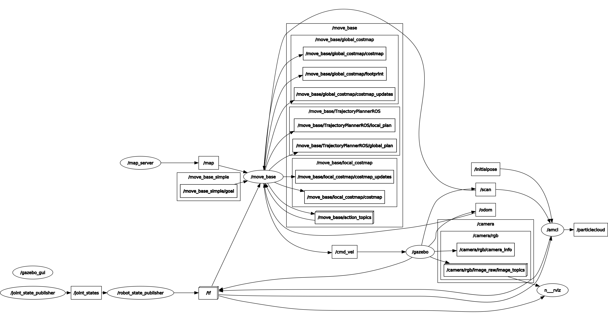

# Where Am I
The aim of the project is to make robot perform autonomous navigation in known 2D map. Localization is performed using AMCL package. User can give navigation goals by using move_base package.

<p align="center">
  
  <br>Robot is navigating autonomously
</p>

## Package
* `my_robot`: Which includes robot model, 2D map, AMCL and move_base parameters, rviz configuration.

## Nodes
* `map_server`: Which publishes **/map** topic.
* `move_base`: Which subscribes to **/map**, **/tf**, **/scan**, **/odom** topic and publishes **/cmd_vel** topic. 
* `amcl`: Which subscribes to **/scan** topic and publishes **/tf** topic.

<p align="center">
  
  <br>Rosgraph of the project
</p>

## How to use
```bash
roslaunch my_robot world.launch
roslaunch my_robot amcl.launch 
```
